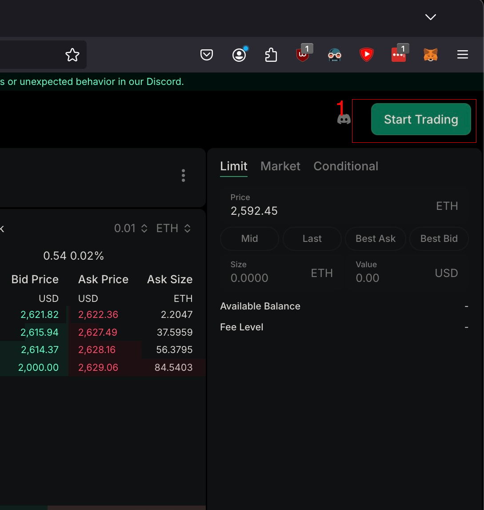
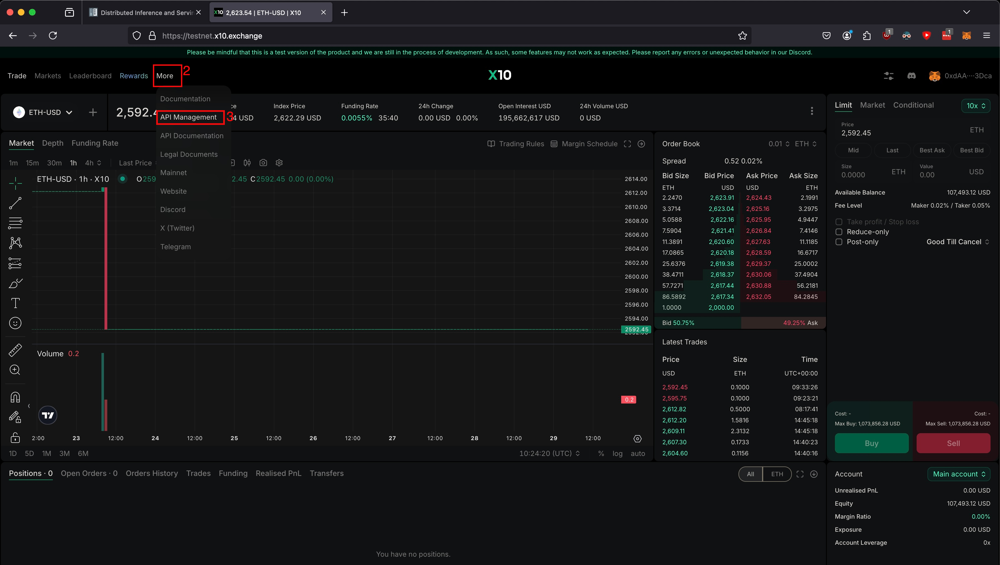
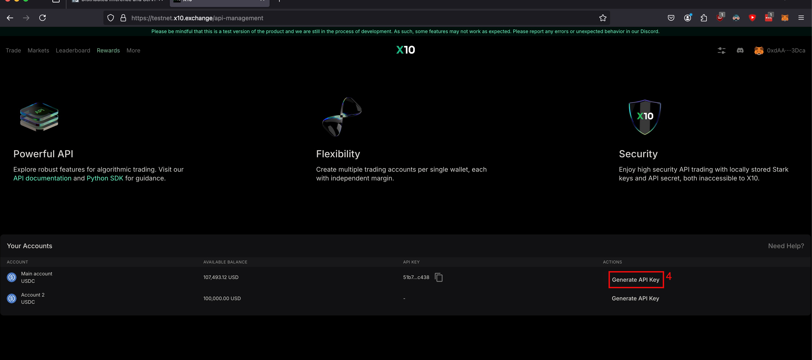
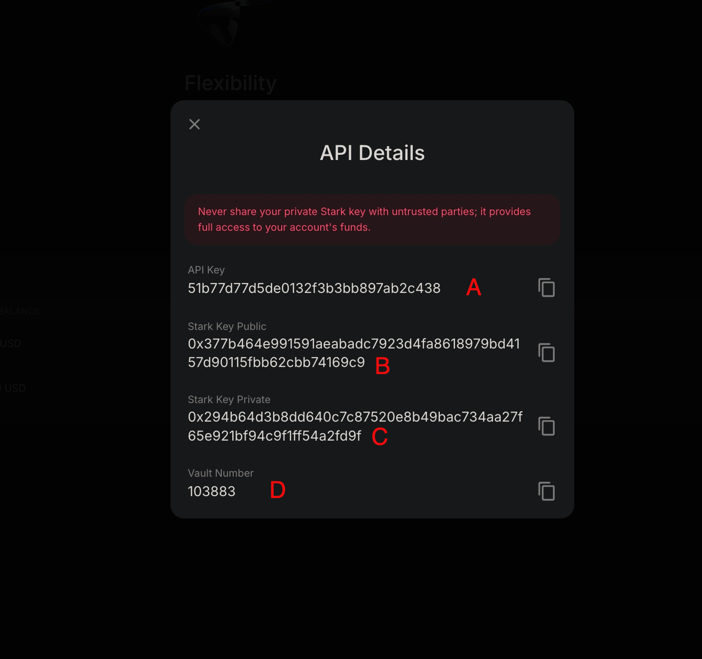
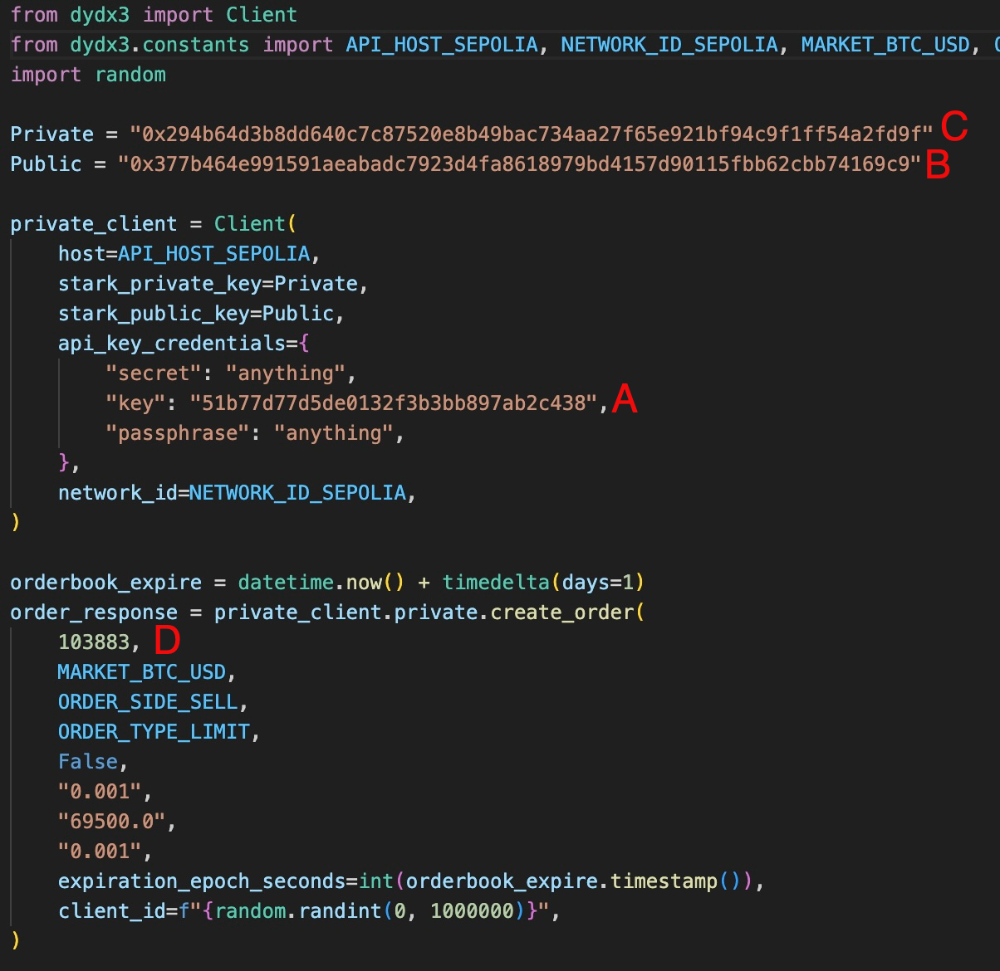

Python client for X10 Legacy API (v3 API).

## Installation

The `x10-v3-python` package is available as a direct install from github. Install with `pip`:

```bash
pip install git+https://github.com/ex10ded/dydx-v3-python.git
```

If you wish to verify the diffs with the upstream dydx v3 SDK, you can do so [here](https://github.com/dydxprotocol/dydx-v3-python/compare/master...ex10ded:dydx-v3-python:master). The only diffs should be asset configuration and removal of functionality not offered via the legacy API.  

## Getting Started

Currently due to signing scheme differences, you must onboard through the x10 UI to obtain trading credentials. 

Proceed to https://testnet.x10.exchange and connect / register 


Navigate to the Api Management Screen


Generate Api Credentials


View Api Credentials


After obtaining your API credentials, you can put them into code as follows

* Public and Private Keys are self named. 
* Vault corresponds to DyDx "positionId"
* ApiKey is self named. 



more details are in the [RestApi Example](x10_example.py) and the [WebSocket Example](websockets_example.py)